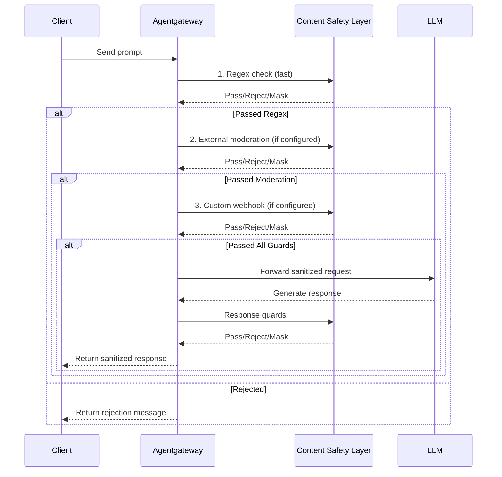

Protect LLM requests and responses from sensitive data exposure and harmful content using layered content safety controls.

## About

Content safety helps you prevent sensitive information from reaching LLM providers and block harmful content in both requests and responses. Content safety practices broadly cover a range of techniques including personally identifiable information (PII) detection, PII sanitization, data loss prevention, prompt guards, and other guardrail features.

 provides a layered approach to content safety through prompt guards that can reject, mask, or moderate content before it reaches the LLM or returns to users.

You can layer multiple protection mechanisms to create comprehensive content safety:
- **Regex-based detection**: Fast, deterministic matching for known patterns like credit cards, SSNs, emails, and custom patterns
- **External moderation**: Leverage cloud provider guardrails for advanced content filtering
- **Custom webhooks**: Integrate your own content safety logic for specialized requirements

This guide shows you how to use each layer and combine them for defense-in-depth content protection.

### How content safety works

 processes content safety checks in the request and response paths. You can configure multiple prompt guards that run in sequence, allowing you to combine different detection methods.



The diagram shows content flowing through multiple guard layers. Each layer can:
- **Pass**: Allow content to proceed to the next layer
- **Reject**: Block the request and return an error message
- **Mask**: Replace sensitive patterns with placeholders and continue

### Choose the right approach

Use this table to decide which content safety layer to use for your requirements.

| Requirement | Recommended Approach | Reason |
|-------------|---------------------|--------|
| Detect known PII formats (SSN, credit cards, emails) | Regex with builtins | Fast, deterministic, no external dependencies |
| Block hate speech, violence, harmful content | External moderation (OpenAI, Bedrock) | ML-based detection trained for content safety |
| Organization-specific restricted terms | Regex with custom patterns | Simple pattern matching for known strings |
| Named entity recognition (people, orgs, places) | Custom webhook | Requires NER models not available in built-in options |
| HIPAA, PCI-DSS, or other compliance requirements | Layered approach | Combine regex + external moderation + custom validation |
| Integration with existing DLP tools | Custom webhook | Allows reuse of existing security infrastructure |
| Fastest performance with minimal latency | Regex only | No external API calls |
| Most comprehensive protection | All three layers | Defense-in-depth with multiple detection methods |

### Performance considerations

Each content safety layer adds latency to requests. Plan your configuration accordingly.

- **Regex guards**: < 1ms per check, negligible latency impact
- **External moderation**: 50-200ms depending on provider and network latency
- **Custom webhooks**: Varies based on webhook implementation and location

To optimize performance:
- Use regex for fast, deterministic checks before slower external checks
- Deploy webhook servers in the same region as the gateway
- Configure appropriate timeouts for external moderation endpoints
- Consider request size limits to avoid processing very large prompts

For webhook-specific performance tuning, see the [Guardrail Webhook optimization guide](#optimize-performance).


**Evaluation order**: Prompt guards are evaluated *after* rate limiting. This means that requests rejected by content safety checks (403 Forbidden) still consume rate limit quota. If you want to avoid consuming quota on blocked requests, authentication policies (JWT/OPA) are evaluated before rate limiting and can prevent quota consumption.


## Before you begin



## Layer 1: Regex-based detection

Regex-based prompt guards provide fast, deterministic pattern matching for known sensitive data formats. Use this layer for common PII patterns and custom organization-specific strings.

### Built-in patterns

 includes built-in regex patterns for common sensitive data types:
- `CreditCard`: Credit card numbers (Visa, MasterCard, Amex, Discover)
- `Ssn`: US Social Security Numbers
- `Email`: Email addresses
- `PhoneNumber`: US phone numbers
- `CaSin`: Canadian Social Insurance Numbers

Example configuration that masks credit cards in responses:

```yaml,paths="content-safety-regex"
kubectl apply -f - <<EOF
apiVersion: 
kind: 
metadata:
  name: content-safety-regex
  namespace: 
spec:
  targetRefs:
  - group: gateway.networking.k8s.io
    kind: HTTPRoute
    name: openai
  backend:
    ai:
      promptGuard:
        response:
        - regex:
            builtins:
            - CreditCard
            - Ssn
            - Email
            action: Mask
EOF
```

### Custom patterns

You can also define custom regex patterns for organization-specific sensitive data.

Example that rejects requests containing specific restricted terms:

```yaml
kubectl apply -f - <<EOF
apiVersion: 
kind: 
metadata:
  name: content-safety-custom
  namespace: 
spec:
  targetRefs:
  - group: gateway.networking.k8s.io
    kind: HTTPRoute
    name: openai
  backend:
    ai:
      promptGuard:
        request:
        - response:
            message: "Request blocked due to policy violation"
          regex:
            action: Reject
            matches:
            - "confidential"
            - "internal-only"
            - "project-\\w+-secret"  # Custom pattern with regex
EOF
```

### Test regex guards

Send a request with a fake credit card number and verify it gets masked in the response:



{}
```sh
curl "$INGRESS_GW_ADDRESS/openai" -H content-type:application/json -d '{
  "model": "gpt-3.5-turbo",
  "messages": [
    {
      "role": "user",
      "content": "What type of number is 5105105105105100?"
    }
  ]
}' | jq
```
{}

{}
```sh
curl "localhost:8080/openai" -H content-type:application/json -d '{
  "model": "gpt-3.5-turbo",
  "messages": [
    {
      "role": "user",
      "content": "What type of number is 5105105105105100?"
    }
  ]
}' | jq
```
{}



Example output showing the credit card masked as `<CREDIT_CARD>`:

```json
{
  "choices": [
    {
      "message": {
        "content": "<CREDIT_CARD> is an even number."
      }
    }
  ]
}
```


kubectl apply -f - <<EOF
apiVersion: agentgateway.dev/v1alpha1
kind: AgentgatewayPolicy
metadata:
  name: content-safety-regex-httpbun
  namespace: agentgateway-system
spec:
  targetRefs:
  - group: gateway.networking.k8s.io
    kind: HTTPRoute
    name: httpbun-llm
  backend:
    ai:
      promptGuard:
        response:
        - regex:
            builtins:
            - CreditCard
            - Ssn
            - Email
            action: Mask
EOF

YAMLTest -f - <<'EOF'
- name: verify credit card is masked in response
  http:
    url: "http://${INGRESS_GW_ADDRESS}:80/v1/chat/completions"
    method: POST
    headers:
      content-type: application/json
    body: |
      {
        "model": "gpt-4",
        "messages": [
          {
            "role": "user",
            "content": "What type of number is 5105105105105100?"
          }
        ],
        "httpbun": {"content": "The number 5105105105105100 is a Mastercard test card number."}
      }
  source:
    type: local
  expect:
    statusCode: 200
    bodyJsonPath:
      - path: "$.choices[0].message.content"
        comparator: contains
        value: "<CREDIT_CARD>"
EOF


## Layer 2: External moderation endpoints

External moderation endpoints use cloud provider AI services to detect harmful content, hate speech, violence, and other policy violations. These services often use ML models trained specifically for content moderation.

### OpenAI Moderation

The OpenAI Moderation API detects potentially harmful content across categories including hate, harassment, self-harm, sexual content, and violence.

1. Create a secret with your OpenAI API key:
   ```sh
   kubectl create secret generic openai-secret \
     -n  \
     --from-literal="Authorization=Bearer $OPENAI_API_KEY"
   ```

2. Configure the prompt guard to use OpenAI Moderation:
   ```yaml
   kubectl apply -f - <<EOF
   apiVersion: 
   kind: 
   metadata:
     name: content-safety-openai
     namespace: 
   spec:
     targetRefs:
     - group: gateway.networking.k8s.io
       kind: HTTPRoute
       name: openai
     backend:
       ai:
         promptGuard:
           request:
           - openAIModeration:
               policies:
                 auth:
                   secretRef:
                     name: openai-secret
               model: omni-moderation-latest
             response:
               message: "Content blocked by moderation policy"
   EOF
   ```

3. Test with content that triggers moderation:
   

   {}
   ```sh
   curl -i "$INGRESS_GW_ADDRESS/openai" \
     -H "content-type: application/json" \
     -d '{
       "model": "gpt-4o-mini",
       "messages": [
         {
           "role": "user",
           "content": "I want to harm myself"
         }
       ]
     }'
   ```
   {}

   {}
   ```sh
   curl -i "localhost:8080/openai" \
     -H "content-type: application/json" \
     -d '{
       "model": "gpt-4o-mini",
       "messages": [
         {
           "role": "user",
           "content": "I want to harm myself"
         }
       ]
     }'
   ```
   {}

   

   Expected response:
   ```
   HTTP/1.1 403 Forbidden
   Content blocked by moderation policy
   ```

### AWS Bedrock Guardrails

AWS Bedrock Guardrails provide content filtering, PII detection, topic restrictions, and word filters. You must first create a guardrail in the AWS Bedrock console.


For instructions on creating Bedrock Guardrails, see the [AWS Bedrock Guardrails documentation](https://docs.aws.amazon.com/bedrock/latest/userguide/guardrails-permissions.html).


1. Get your guardrail identifier and version:
   ```sh
   aws bedrock list-guardrails
   ```

2. Configure the prompt guard:
   ```yaml
   kubectl apply -f - <<EOF
   apiVersion: 
   kind: 
   metadata:
     name: content-safety-bedrock
     namespace: 
   spec:
     targetRefs:
     - group: gateway.networking.k8s.io
       kind: HTTPRoute
       name: openai
     backend:
       ai:
         promptGuard:
           request:
           - bedrockGuardrails:
               identifier: your-guardrail-id
               version: "1"  # or "DRAFT"
               region: us-west-2
               policies:
                 auth:
                   aws: {}
           response:
           - bedrockGuardrails:
               identifier: your-guardrail-id
               version: "1"
               region: us-west-2
               policies:
                 auth:
                   aws: {}
   EOF
   ```


The `aws: {}` configuration uses the default AWS credential chain (IAM role, environment variables, or instance profile). For authentication details, see the [AWS authentication documentation](https://docs.aws.amazon.com/sdk-for-go/api/aws/session/).


### Google Model Armor

Google Model Armor (formerly Vertex AI Safety) provides content safety filtering for Google Cloud customers. Configuration follows a similar pattern to other external moderation endpoints.


For Google Model Armor configuration details, consult the Google Cloud documentation for Vertex AI content safety features.


## Layer 3: Custom webhook integration

For advanced content safety requirements beyond regex and cloud provider services, you can integrate custom webhook servers. This allows you to use specialized ML models, proprietary detection logic, or integrate with existing security tools.

### Use cases for custom webhooks

- Named Entity Recognition (NER) for detecting person names, organizations, locations
- Industry-specific compliance rules (HIPAA, PCI-DSS, GDPR)
- Integration with existing DLP or security tools
- Custom ML models for domain-specific content detection
- Multi-step validation workflows
- Advanced contextual analysis

### Webhook configuration

Configure a prompt guard to call your webhook service:

```yaml
kubectl apply -f - <<EOF
apiVersion: 
kind: 
metadata:
  name: content-safety-webhook
  namespace: 
spec:
  targetRefs:
  - group: gateway.networking.k8s.io
    kind: HTTPRoute
    name: openai
  backend:
    ai:
      promptGuard:
        request:
        - webhook:
            backendRef:
              kind: Service
              name: content-safety-webhook
              port: 8000
        response:
        - webhook:
            backendRef:
              kind: Service
              name: content-safety-webhook
              port: 8000
EOF
```

For a complete guide on implementing and deploying custom webhook servers, see the [Guardrail Webhook API documentation]().

## Combining multiple layers

You can configure multiple prompt guards that run in sequence, creating defense-in-depth protection. Guards are evaluated in the order they appear in the configuration.

Example configuration that uses all three layers:

```yaml
kubectl apply -f - <<EOF
apiVersion: 
kind: 
metadata:
  name: content-safety-layered
  namespace: 
spec:
  targetRefs:
  - group: gateway.networking.k8s.io
    kind: HTTPRoute
    name: openai
  backend:
    ai:
      promptGuard:
        request:
        # Layer 1: Fast regex check for known patterns
        - regex:
            builtins:
            - Ssn
            - CreditCard
            - Email
            action: Reject
          response:
            message: "Request contains PII and cannot be processed"
        # Layer 2: OpenAI moderation for harmful content
        - openAIModeration:
            policies:
              auth:
                secretRef:
                  name: openai-secret
            model: omni-moderation-latest
          response:
            message: "Content blocked by moderation policy"
        # Layer 3: Custom webhook for domain-specific checks
        - webhook:
            backendRef:
              kind: Service
              name: content-safety-webhook
              port: 8000
        response:
        # Response guards run in same order
        - regex:
            builtins:
            - Ssn
            - CreditCard
            action: Mask
        - webhook:
            backendRef:
              kind: Service
              name: content-safety-webhook
              port: 8000
EOF
```

## What's next

- [Configure prompt guards]() for step-by-step examples of regex-based guards
- [Guardrail Webhook API]() for implementing custom content safety logic
- [Track costs]() to monitor the impact of blocked requests on your budget
- [Set up observability]() to track content safety metrics
