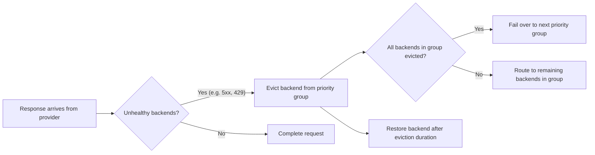

Prioritize the failover of requests across different models from an LLM provider. Include outlier detection of unhealthy LLM backends to automatically fail over when getting throttled by an unperformant model.

## About failover {#about}

Use failover (automatic fallback) to keep services running by switching to a backup when the main system fails or becomes unavailable.

For , you can set up failover across models and LLM providers. When a provider becomes unhealthy (such as returning errors or getting rate-limited), the system automatically switches to a backup provider. This configuration keeps the service running without interruptions.

Failover in  has two parts:

- **Priority groups** in the  define the failover order. Each group is a tier. Models within the same group are load balanced equally. When all models in a group are evicted, requests fail over to the next group.
- **A health policy** in an  defines what counts as an unhealthy response (such as 5xx errors or 429 rate limits) and how to evict unhealthy backends. Without a health policy, backends are not evicted and failover does not occur.

This approach increases the resiliency of your network environment by ensuring that apps that call LLMs can keep working without problems, even if one model has issues.

### Example flow

Failover works through backend eviction, as described in the following diagram.



1. A response arrives from a provider.
2. The `unhealthyCondition` CEL expression is evaluated. If `true`, the response is marked unhealthy.
3. If eviction thresholds are met (such as `consecutiveFailures`), the backend is evicted from its priority group for the configured `duration`.
4. When all backends in a priority group are evicted, the load balancer automatically routes to the next available group.
5. Evicted backends are restored after their eviction duration expires. The eviction duration uses multiplicative backoff on repeated evictions.

**Rate-limit handling:** When a 429 response includes a `Retry-After` header, agentgateway uses that duration as the eviction time (overriding the configured `duration`). However, 429 responses only trigger eviction if your `unhealthyCondition` includes them (for example, `response.code >= 500 || response.code == 429`).

### Failover vs. traffic splitting {#traffic-splitting}

Failover uses priority groups to automatically switch between backends when failures occur. 

For weight-based traffic distribution (A/B testing, traffic splitting, or canary deployments), see [Traffic splitting]().

For locality-aware routing (zones and regions), see [Locality-aware routing]().

## Before you begin

1. Set up an [agentgateway proxy]().
2. Set up [API access to each LLM provider]() that you want to use. The examples in this guide use OpenAI and Anthropic.


# Create an AgentgatewayBackend with 2 priority groups using httpbun as mock LLM.
# Group 1 (highest priority): httpbun /status/500 — always returns 500 to trigger eviction.
# Group 2 (fallback): httpbun /llm/chat/completions — returns normal 200 responses.
kubectl apply -f- <<EOF
apiVersion: agentgateway.dev/v1alpha1
kind: AgentgatewayBackend
metadata:
  name: model-failover
  namespace: agentgateway-system
spec:
  ai:
    groups:
      - providers:
          - name: primary-llm
            openai:
              model: gpt-4
            host: httpbun.default.svc.cluster.local
            port: 3090
            path: "/status/500"
      - providers:
          - name: fallback-llm
            openai:
              model: gpt-4
            host: httpbun.default.svc.cluster.local
            port: 3090
            path: "/llm/chat/completions"
EOF



YAMLTest -f - <<'EOF'
- name: wait for model-failover backend to be accepted
  wait:
    target:
      kind: AgentgatewayBackend
      metadata:
        namespace: agentgateway-system
        name: model-failover
    jsonPath: "$.status.conditions[?(@.type=='Accepted')].status"
    jsonPathExpectation:
      comparator: equals
      value: "True"
    polling:
      timeoutSeconds: 60
      intervalSeconds: 2
EOF



# Create the HTTPRoute for the failover backend.
kubectl apply -f- <<EOF
apiVersion: gateway.networking.k8s.io/v1
kind: HTTPRoute
metadata:
  name: model-failover
  namespace: agentgateway-system
spec:
  parentRefs:
    - name: agentgateway-proxy
      namespace: agentgateway-system
  rules:
  - matches:
    - path:
        type: PathPrefix
        value: /model
    backendRefs:
    - name: model-failover
      namespace: agentgateway-system
      group: agentgateway.dev
      kind: AgentgatewayBackend
EOF



YAMLTest -f - <<'EOF'
- name: wait for model-failover HTTPRoute to be accepted
  wait:
    target:
      kind: HTTPRoute
      metadata:
        namespace: agentgateway-system
        name: model-failover
    jsonPath: "$.status.parents[0].conditions[?(@.type=='Accepted')].status"
    jsonPathExpectation:
      comparator: equals
      value: "True"
    polling:
      timeoutSeconds: 60
      intervalSeconds: 2
- name: wait for model-failover HTTPRoute refs to be resolved
  wait:
    target:
      kind: HTTPRoute
      metadata:
        namespace: agentgateway-system
        name: model-failover
    jsonPath: "$.status.parents[0].conditions[?(@.type=='ResolvedRefs')].status"
    jsonPathExpectation:
      comparator: equals
      value: "True"
    polling:
      timeoutSeconds: 60
      intervalSeconds: 2
EOF



# Create the AgentgatewayPolicy with health/eviction settings.
kubectl apply -f- <<EOF
apiVersion: agentgateway.dev/v1alpha1
kind: AgentgatewayPolicy
metadata:
  name: model-failover-health
  namespace: agentgateway-system
spec:
  targetRefs:
  - group: agentgateway.dev
    kind: AgentgatewayBackend
    name: model-failover
  backend:
    health:
      unhealthyCondition: "response.code >= 500 || response.code == 429"
      eviction:
        duration: 10s
        consecutiveFailures: 1
EOF



YAMLTest -f - <<'EOF'
- name: wait for model-failover-health policy to be accepted
  wait:
    target:
      kind: AgentgatewayPolicy
      metadata:
        namespace: agentgateway-system
        name: model-failover-health
    jsonPath: "$.status.ancestors[0].conditions[?(@.type=='Accepted')].status"
    jsonPathExpectation:
      comparator: equals
      value: "True"
    polling:
      timeoutSeconds: 120
      intervalSeconds: 2
EOF



# Get the gateway address.
export INGRESS_GW_ADDRESS=$(kubectl get svc -n agentgateway-system agentgateway-proxy -o=jsonpath="{.status.loadBalancer.ingress[0]['hostname','ip']}")

# First request hits the primary group (/status/500) — triggers eviction.
# The client receives a 500 for this request.
curl -s -o /dev/null -w "%{http_code}" "http://${INGRESS_GW_ADDRESS}/model" \
  -H "Content-Type: application/json" \
  -d '{"messages": [{"role": "user", "content": "Hello"}]}'

# Brief pause for eviction to take effect.
sleep 2

# Second request: primary is evicted, so it routes to the fallback group (/llm/chat/completions) — should return 200.
YAMLTest -f - <<'EOF'
- name: verify failover to fallback group returns 200
  http:
    url: "http://${INGRESS_GW_ADDRESS}/model"
    method: POST
    headers:
      Content-Type: application/json
    body: |
      {
        "messages": [{"role": "user", "content": "Hello"}]
      }
  source:
    type: local
  retries: 3
  expect:
    statusCode: 200
    bodyJsonPath:
      - path: "$.usage.total_tokens"
        comparator: greaterThan
        value: 0
EOF



# Cleanup test resources
kubectl delete AgentgatewayBackend model-failover -n agentgateway-system --ignore-not-found
kubectl delete AgentgatewayPolicy model-failover-health -n agentgateway-system --ignore-not-found
kubectl delete httproute model-failover -n agentgateway-system --ignore-not-found


## Fail over to other models {#model-failover}

You can configure failover across multiple models and providers by using priority groups. Each priority group represents a set of providers that share the same priority level. Failover priority is determined by the order in which the priority groups are listed in the . The priority group that is listed first is assigned the highest priority.

Models within the same priority group are [load balanced]() using the Power of Two Choices (P2C) algorithm, which intelligently routes requests based on health, latency, and current load, not just simple round-robin. This pattern of P2C load balancing within a tier with failover across tiers provides superior performance compared to named strategies.

For weight-based traffic distribution within a priority group (such as 80/20 splits for A/B testing or canary rollouts), see [Traffic splitting]().

1. Create or update the  for your LLM providers.

   
   {}
   
   In this example, you configure separate priority groups for failover across multiple models from the same LLM provider, OpenAI. Each model is in its own priority group. The order of the groups determines the failover priority. If the first model is evicted, requests fail over to the second group, and so on.
   
   1. OpenAI `gpt-4.1` model (highest priority)
   2. OpenAI `gpt-5.1` model (fallback)
   3. OpenAI `gpt-3.5-turbo` model (lowest priority)


   ```yaml
   kubectl apply -f- <<EOF
   apiVersion: agentgateway.dev/v1alpha1
   kind: 
   metadata:
     name: model-failover
     namespace: 
   spec:
     ai:
       groups: 
         - providers: 
             - name: openai-gpt-41
               openai: 
                 model: gpt-4.1
               policies:
                 auth:
                   secretRef:
                     name: openai-secret
         - providers: 
             - name: openai-gpt-51
               openai: 
                 model: gpt-5.1
               policies:
                 auth:
                   secretRef:
                     name: openai-secret
         - providers: 
             - name: openai-gpt-3-5-turbo
               openai: 
                 model: gpt-3.5-turbo
               policies:
                 auth:
                   secretRef:
                     name: openai-secret
   EOF
   ```


   
   {}
   {}
   
   In this example, you configure failover across multiple providers with cost-based priority. The first priority group contains cheaper models. Responses are load-balanced across these models. In the event that both models are unavailable, requests fall back to the second priority group of more premium models.
   - Highest priority: Load balance across cheaper OpenAI `gpt-3.5-turbo` and Anthropic `claude-haiku-4-5-20251001` models.
   - Fallback: Load balance across more premium OpenAI `gpt-4.1` and Anthropic `claude-opus-4-6` models.

   Make sure that you configured both Anthropic and OpenAI providers.


   ```yaml
   kubectl apply -f- <<EOF
   apiVersion: agentgateway.dev/v1alpha1
   kind: 
   metadata:
     name: model-failover
     namespace: 
   spec:
     ai:
       groups: 
         - providers: 
             - name: openai-gpt-3.5-turbo
               openai: 
                 model: gpt-3.5-turbo
               policies:
                 auth:
                   secretRef:
                     name: openai-secret
             - name: claude-haiku
               anthropic:
                 model: claude-haiku-4-5-20251001
               policies:
                 auth:
                   secretRef:
                     name: anthropic-secret
         - providers: 
             - name: openai-gpt-4.1
               openai: 
                 model: gpt-4.1
               policies:
                 auth:
                   secretRef:
                     name: openai-secret
             - name: claude-opus
               anthropic:
                 model: claude-opus-4-6
               policies:
                 auth:
                   secretRef:
                     name: anthropic-secret
   EOF
   ```

   
   {}
   

2. Create an HTTPRoute resource that routes incoming traffic on the `/model` path to the  that you created in the previous step. In this example, the URLRewrite filter rewrites the path from `/model` to the path of the API in the LLM provider that you want to use, such as `/v1/chat/completions` for OpenAI.

  
   
   ```yaml
   kubectl apply -f- <<EOF
   apiVersion: gateway.networking.k8s.io/v1
   kind: HTTPRoute
   metadata:
     name: model-failover
     namespace: 
   spec:
     parentRefs:
       - name: agentgateway-proxy
         namespace: 
     rules:
     - matches:
       - path:
           type: PathPrefix
           value: /model
       backendRefs:
       - name: model-failover
         namespace: 
         group: agentgateway.dev
         kind: 
   EOF
   ```
   

3. Create an  with a health policy that targets the . The health policy defines which responses are considered unhealthy and how to evict backends. Without this policy, backends are not evicted and failover does not occur.

   The `unhealthyCondition` field is an optional [CEL expression](https://github.com/cel-expr/cel-spec) that classifies each response. When you set it, `true` means the response counts as unhealthy toward eviction. The `eviction` settings control how many failures and how long an unhealthy backend stays out of its priority group.

   
   {}

   This configuration evicts backends on both server errors (5xx) and rate-limit responses (429). This way, when you get throttled by one LLM provider, agentgateway automatically fails over to another.

   ```yaml
   kubectl apply -f- <<EOF
   apiVersion: 
   kind: 
   metadata:
     name: model-failover-health
     namespace: 
   spec:
     targetRefs:
     - group: agentgateway.dev
       kind: 
       name: model-failover
     backend:
       health:
         unhealthyCondition: "response.code >= 500 || response.code == 429"
         eviction:
           duration: 10s
           consecutiveFailures: 1
   EOF
   ```

   {}
   {}

   This configuration evicts backends only on server errors (5xx) or connection failures. Rate-limited (429) responses lower the backend's health score but do not trigger eviction.

   ```yaml
   kubectl apply -f- <<EOF
   apiVersion: 
   kind: 
   metadata:
     name: model-failover-health
     namespace: 
   spec:
     targetRefs:
     - group: agentgateway.dev
       kind: 
       name: model-failover
     backend:
       health:
         unhealthyCondition: "response.code >= 500"
         eviction:
           duration: 10s
           consecutiveFailures: 3
   EOF
   ```

   {}
   

   

   | Setting | Description |
   | --- | --- |
   | `unhealthyCondition` | Optional CEL expression that classifies each response as healthy or unhealthy. When you set this field, `true` means the response counts as unhealthy toward eviction (together with `eviction`). When you omit this field, 5xx responses and connection failures still lower the backend health score for load balancing, but that built-in behavior does not trigger eviction by itself. |
   | `eviction.duration` | Base time to remove an unhealthy backend from its priority group. Increases with multiplicative backoff on repeated evictions. When a 429 response includes `Retry-After`, that value is used instead. You might try `10s`–`60s` depending on how quickly you want failover versus avoiding flapping on brief errors. Shorter durations fail over faster. If you omit this field, the default is `3s`. |
   | `eviction.consecutiveFailures` | Number of consecutive unhealthy responses required before evicting. You might start with `3` so that a single transient error does not evict the backend. For tests, use `1` for immediate eviction. |

4. Verify that failover works by temporarily configuring the health policy to treat all responses as unhealthy. This policy forces each backend to be evicted after its first response, so you can watch requests progress through the priority groups.

   Update the  to set `unhealthyCondition` to `"true"`:

   ```yaml
   kubectl apply -f- <<EOF
   apiVersion: 
   kind: 
   metadata:
     name: model-failover-health
     namespace: 
   spec:
     targetRefs:
     - group: agentgateway.dev
       kind: 
       name: model-failover
     backend:
       health:
         unhealthyCondition: "true"
         eviction:
           duration: 30s
           consecutiveFailures: 1
   EOF
   ```

   Send multiple requests in sequence. Check the `model` field in each response to confirm that requests progress through the priority groups as each backend is evicted.

   
   {}
   ```bash
   for i in 1 2 3; do
     echo "=== Request $i ==="
     curl -s "$INGRESS_GW_ADDRESS/model" -H content-type:application/json -d '{
       "messages": [{"role": "user", "content": "Say hello in one word."}]
     }' | jq '{model, status: .choices[0].finish_reason}'
     echo
   done
   ```
   {}
   {}
   ```bash
   for i in 1 2 3; do
     echo "=== Request $i ==="
     curl -s "localhost:8080/model" -H content-type:application/json -d '{
       "messages": [{"role": "user", "content": "Say hello in one word."}]
     }' | jq '{model, status: .choices[0].finish_reason}'
     echo
   done
   ```
   
   

   
   {}

   With the OpenAI model priority configuration, each request evicts the current group's backend and the next request routes to the next group. You can see the `model` field change with each request:

   ```text
   === Request 1 ===
   { "model": "gpt-4.1-2025-04-14", "status": "stop" }

   === Request 2 ===
   { "model": "gpt-5.1-2025-04-14", "status": "stop" }

   === Request 3 ===
   { "model": "gpt-3.5-turbo-0125", "status": "stop" }
   ```
   
   {}
   {}

   With the cost-based configuration, the first two requests are load balanced across the two providers in the first priority group. After both are evicted, the third request fails over to the second priority group:

   ```text
   === Request 1 ===
   { "model": "gpt-3.5-turbo-0125", "status": "stop" }

   === Request 2 ===
   { "model": "claude-haiku-4-5-20251001", "status": "stop" }

   === Request 3 ===
   { "model": "gpt-4.1-2025-04-14", "status": "stop" }
   ```
   
   {}
   

Now that you tested failover, restore the health policy to your production configuration. Reapply the policy from step 3 with your `unhealthyCondition` settings (such as `response.code >= 500 || response.code == 429`, where `>= 500` matches HTTP 5xx server errors).

## Cleanup



```shell
kubectl delete  model-failover -n 
kubectl delete  model-failover-health -n 
kubectl delete httproute model-failover -n 
```

## Next

Explore other agentgateway features.

* Learn more about [load balancing strategies]() and the P2C algorithm.
* Pass in [functions]() to an LLM to request as a step towards agentic AI.
* Set up [prompt guards]() to block unwanted requests and mask sensitive data.
* [Enrich your prompts]() with system prompts to improve LLM outputs.
