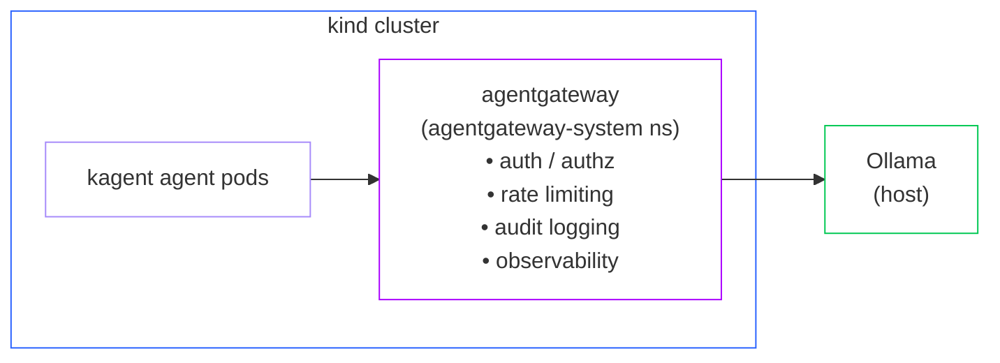

[Kagent](https://github.com/kagent-dev/kagent) is a Kubernetes-native AI agent framework that brings autonomous agents to cloud-native environments. It leverages Kubernetes primitives for agent lifecycle management, scaling, and orchestration.

## What is kagent?

Kagent provides a Kubernetes-native approach to running AI agents:

- **CRD-based Configuration** - Define agents as Kubernetes resources
- **Native Scaling** - Horizontal pod autoscaling for agent workloads
- **MCP Support** - Built-in Model Context Protocol for tool access
- **A2A Communication** - Agent-to-agent messaging via Kubernetes services
- **GitOps Ready** - Declarative agent definitions for Flux/ArgoCD

## Why use agentgateway with kagent?

Kagent agents running in Kubernetes need enterprise governance:

| Kubernetes Challenge | agentgateway Solution |
|---------------------|----------------------|
| Multi-tenant clusters | Namespace-aware policies |
| Service-to-service auth | mTLS and JWT validation |
| Distributed tracing | OpenTelemetry integration |
| Cost allocation | Per-namespace token tracking |
| Compliance requirements | Centralized audit logging |

## Before you begin


4. Follow the [Ollama]() guide to install and setup Ollama.

## Architecture

This guide sets up kagent and agentgateway in a kind cluster, as shown in the following diagram.


## Install kagent

Install kagent in your cluster. For more information, see the [kagent docs](https://kagent.dev/docs/kagent/introduction/installation).
1. Install kagent CRDs.
   ```shell
   helm install kagent-crds oci://ghcr.io/kagent-dev/kagent/helm/kagent-crds \
       --namespace kagent \
       --create-namespace
   ```

2. Install kagent.
   ```shell
   helm install kagent oci://ghcr.io/kagent-dev/kagent/helm/kagent \
     --namespace kagent \
     --create-namespace \
     --set providers.default=ollama \
     --set providers.ollama.baseUrl=http://agentgateway-proxy.agentgateway-system.svc.cluster.local/v1 \
     --set providers.ollama.apiKey=dummy
   ```

3. Verify everything is up and running.
   ```shell
   kubectl get pods -n kagent
   ```

   Example output:
   ```shell
   argo-rollouts-conversion-agent-7f8cdbd6f7-6tvl2   1/1     Running   0              5h2m
   cilium-debug-agent-6588998448-gr8tc               1/1     Running   0              5h2m
   cilium-manager-agent-d9468b549-tbqmk              1/1     Running   0              5h2m
   cilium-policy-agent-68d6c9bbf8-tgrzc              1/1     Running   0              5h2m
   helm-agent-66845fccdb-65wj5                       1/1     Running   0              5h2m
   istio-agent-6968fddf87-qtcrg                      1/1     Running   0              5h2m
   k8s-agent-64858b5476-6nw76                        1/1     Running   0              168m
   kagent-controller-9bfbc5b5b-lfxfx                 1/1     Running   0              5h5m
   kagent-grafana-mcp-64c84f5b59-jpp98               1/1     Running   0              5h5m
   kagent-kmcp-controller-manager-877f8dd7c-brw5h    1/1     Running   0              5h5m
   kagent-postgresql-7956f487fd-fznnz                1/1     Running   0              5h5m
   kagent-querydoc-865fb84c44-kbl2m                  1/1     Running   0              5h5m
   kagent-tools-55cc7db799-qrk5c                     1/1     Running   0              5h5m
   kagent-ui-6d78884f6f-c64b5                        1/1     Running   0              5h5m
   kgateway-agent-876d7c9dc-jpcbv                    1/1     Running   0              5h2m
   observability-agent-7f8b568666-zvmbh              1/1     Running   0              5h2m
   promql-agent-5499d6db5-lvf77                      1/1     Running   0              5h2m
   ```

## Setup kagent
1. Create a `ModelConfig` that points to Ollama.
   ```yaml
   kubectl apply -f- <<EOF
   apiVersion: kagent.dev/v1alpha2
   kind: ModelConfig
   metadata:
     name: llama3-model-config
     namespace: kagent
   spec:
     model: llama3
     provider: Ollama
     ollama:
       host: agentgateway-proxy.agentgateway-system.svc.cluster.local
   EOF
   ```

2. Verify that kagent is accessible and correctly functioning.
   
   {}
   ```sh
   export INGRESS_GW_ADDRESS=$(kubectl get svc -n kagent kagent-ui -o jsonpath="{.spec.clusterIP}")
   echo $INGRESS_GW_ADDRESS  
   ```
   {}
   {}
   ```shell
   kubectl port-forward -n kagent service/kagent-ui 8082:8080
   ```
   {}
   

3. Open the kagent UI and try the default `k8s-agent` to confirm everything works end-to-end.
   
   

## Governance Capabilities

Agentgateway provides policies that you can use to govern your kagent environment.
### Block requests with PII
1. Create an `AgentgatewayPolicy` resource to deny requests to the LLM provider that include PII, such as a `email` string in the request body on. For more examples, see the [Guardrails docs]().
   ```yaml
   kubectl apply -f - <<EOF
   apiVersion: agentgateway.dev/v1alpha1
   kind: AgentgatewayPolicy
   metadata:
     name: prompt-guard
     namespace: agentgateway-system
   spec:
     targetRefs:
     - group: gateway.networking.k8s.io
       kind: HTTPRoute
       name: ollama
     backend:
       ai:
         promptGuard:
           request:
           - response:
               message: "Rejected due to inappropriate content"
             regex:
               action: Reject
               matches:
               - "email"
   EOF
   ```

2. Verify the policy by sending a prompt to your agent through the kagent UI that includes the word `email`. You get a `403` response.
   
   

## Cleanup

```shell
kubectl delete agentgatewaypolicy prompt-guard -n agentgateway-system
kubectl delete modelconfig llama3-model-config -n kagent
helm uninstall kagent --namespace kagent
helm uninstall kagent-crds --namespace kagent
kubectl delete namespace kagent
```
