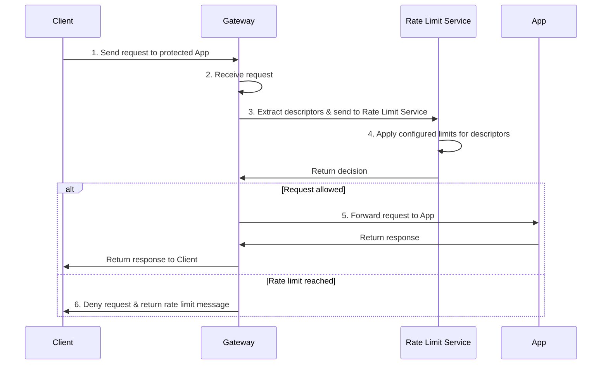

Apply distributed rate limits across multiple agentgateway replicas using an external rate limit service.

## About

Global rate limiting coordinates rate limits across multiple agentgateway proxy replicas using an external service that implements [Envoy's rate limit service protocol](https://www.envoyproxy.io/docs/envoy/latest/configuration/http/http_filters/rate_limit_filter). Unlike local rate limiting, which runs independently on each proxy replica, global rate limiting provides:

- **Shared counters** across all proxy replicas
- **Consistent enforcement** regardless of which replica receives the request
- **Descriptor-based limits** that can extract multiple request attributes using CEL expressions
- **Flexible targeting** by user, API key, IP address, path, or any combination

Global rate limiting is essential when running multiple proxy replicas and you need to enforce a single quota across the entire fleet — for example, "100 requests per minute per user" should apply to the sum of requests across all replicas, not 100 per replica.

Global rate limiting requires two components:

1. ** with `rateLimit.global`**: Configure your rate limit policy with descriptors that extract request attributes using CEL expressions. The policy specifies the rate limit service reference (`backendRef`), a domain identifier, and CEL-based descriptor rules.

2. **Rate Limit Service**: An external service implementing the [Envoy Rate Limit protocol](https://www.envoyproxy.io/docs/envoy/latest/configuration/http/http_filters/rate_limit_filter). The service stores the actual rate limit values, maintains counters in a backend store (typically Redis), and returns allow/deny decisions based on descriptor matching.

### Request flow

Global rate limiting works as follows:

1. A CEL expression in the policy extracts request attributes (such as client IP, user ID, or path)
2. The gateway sends these descriptor key-value pairs to the rate limit service via gRPC
3. The rate limit service matches the descriptors against its configuration and checks the counter
4. If the limit is exceeded, the service returns `OVER_LIMIT`; otherwise it returns `OK` and increments the counter
5. If `OVER_LIMIT` is detected, the gateway returns a 429 response to the client; if the service sends back an `OK`, the request proceeds to the backend

The following sequence diagram shows the request flow with global rate limiting.



### Response headers



### Common CEL expressions {#cel-expressions}

Review the following common CEL expressions that you might find useful when creating your rate limit policies.

| Descriptor | CEL Expression | Description |
|-----------|----------------|-------------|
| Client IP | `source.address` | Source IP address of the client. |
| Request path | `request.path` | The request path (such as `/api/v1/users`). |
| Request method | `request.method` | HTTP method (GET, POST, etc.). |
| Header value | `request.headers["header-name"]` | Extract a specific header. Case-insensitive header name. |
| Query parameter | `request.url_path.query_params["param"]` | Extract a query parameter value. |
| JWT claim | `claims["sub"]` | Extract a claim from a validated JWT (requires JWT auth policy). |
| Static value | `"constant"` | Use a constant string for categorization (such as service tier). |
| Host header | `request.headers["host"]` | The host header value. |
| User agent | `request.headers["user-agent"]` | Client user agent string. |

### Example policy configuration

Review the following example policy, also used in the [Rate limit by client IP](#rate-limit-by-client-ip) section.

```yaml
kubectl apply -f- <<EOF
apiVersion: 
kind: 
metadata:
  name: ip-rate-limit
  namespace: httpbin
spec:
  targetRefs:
  - group: gateway.networking.k8s.io
    kind: HTTPRoute
    name: httpbin
  traffic:
    rateLimit:
      global:
        backendRef:
          name: ratelimit
          namespace: ratelimit
          port: 8081
        domain: agentgateway
        descriptors:
          - entries:
              - name: remote_address
                expression: "source.address"
            unit: Requests
EOF
```

 For more information, refer to the [API docs]().

| Field | Required | Description |
|-------|----------|-------------|
| `backendRef` | Yes | Reference to the rate limit service. Supports `Service` or `Backend` kind. |
| `backendRef.name` | Yes | Name of the Service or Backend. |
| `backendRef.namespace` | Yes | Namespace where the service lives. |
| `backendRef.port` | Yes | gRPC port (typically 8081). |
| `domain` | Yes | Must match the `domain` in the rate limit service configuration. |
| `descriptors` | Yes | Array of descriptor rules (max 16). Each rule extracts request attributes. |
| `descriptors[].entries` | Yes | Array of descriptor entries (max 16). Each entry uses a CEL expression to extract a value. |
| `descriptors[].entries[].name` | Yes | Descriptor name. Must match a `key` in the rate limit service config. Case-sensitive. |
| `descriptors[].entries[].expression` | Yes | CEL expression returning a string. Examples: `source.address`, `request.path`, `request.headers["x-user-id"]`. |
| `descriptors[].unit` | No | Cost unit: `Requests` (default) or `Tokens`. Use `Tokens` for LLM token-based rate limiting. |

## Before you begin



## Deploy the rate limit service {#deploy-service}

You need an external rate limit service that implements the Envoy Rate Limit gRPC protocol. This example uses the reference implementation from Envoy with Redis as the backend store.

1. Create a namespace for the rate limit infrastructure.

   ```sh {paths="global-rate-limit-by-ip,deploy-rate-limit-server"}
   kubectl create namespace ratelimit
   ```

2. Deploy Redis as the backing store.

   ```yaml {paths="global-rate-limit-by-ip,deploy-rate-limit-server"}
   kubectl apply -f- <<EOF
   apiVersion: apps/v1
   kind: Deployment
   metadata:
     name: redis
     namespace: ratelimit
   spec:
     replicas: 1
     selector:
       matchLabels:
         app: redis
     template:
       metadata:
         labels:
           app: redis
       spec:
         containers:
           - name: redis
             image: redis:7-alpine
             ports:
               - containerPort: 6379
   ---
   apiVersion: v1
   kind: Service
   metadata:
     name: redis
     namespace: ratelimit
   spec:
     selector:
       app: redis
     ports:
       - port: 6379
   EOF
   ```

3. Create a ConfigMap with rate limit rules. This configuration defines the actual rate limits that are enforced by the rate limit service. The configuration includes rate limits by client IP (10 requests per minute), a per-user LLM token budget (100 tokens per day, used by the [virtual keys guide]()), by path (100 requests per minute for `/api/v1`, 200 for `/api/v2`), by user ID (50 requests per minute for most users, 500 for VIP users), and by service tier (1000 requests per minute for premium, 100 for standard).

   ```yaml {paths="global-rate-limit-by-ip,deploy-rate-limit-server"}
   kubectl apply -f- <<EOF
   apiVersion: v1
   kind: ConfigMap
   metadata:
     name: ratelimit-config
     namespace: ratelimit
   data:
     config.yaml: |
       domain: agentgateway
       descriptors:
         # Rate limit by client IP: 10 requests per minute
         - key: remote_address
           rate_limit:
             unit: minute
             requests_per_unit: 10

         # Per-user LLM token budget (see the virtual keys guide).
         # Deliberately small so you can exhaust it in a few requests; raise for production.
         - key: user_id
           rate_limit:
             unit: day
             requests_per_unit: 100

         # Rate limit by path
         - key: path
           value: "/api/v1"
           rate_limit:
             unit: minute
             requests_per_unit: 100
         - key: path
           value: "/api/v2"
           rate_limit:
             unit: minute
             requests_per_unit: 200

         # Rate limit by user ID header
         - key: x-user-id
           rate_limit:
             unit: minute
             requests_per_unit: 50

         # Rate limit by user ID with specific value (VIP user)
         - key: x-user-id
           value: vip-user-123
           rate_limit:
             unit: minute
             requests_per_unit: 500

         # Generic service tier rate limit
         - key: service
           value: premium
           rate_limit:
             unit: minute
             requests_per_unit: 1000
         - key: service
           value: standard
           rate_limit:
             unit: minute
             requests_per_unit: 100
   EOF
   ```

   

   | Field | Description |
   |-------|-------------|
   | `domain` | Arbitrary identifier grouping rate limit rules. Multiple teams can use different domains to maintain separate configurations. Must match the `domain` in your . |
   | `descriptors` | Array of rate limit rules. Each descriptor matches against request attributes. |
   | `key` | The descriptor name. Must match the `name` field in the policy's descriptor entries. Case-sensitive. |
   | `value` | Optional. Enables fine-grained matching. For example, different rate limits for different paths or user IDs. |
   | `rate_limit` | The actual rate limit to enforce. |
   | `unit` | Time window: `second`, `minute`, `hour`, or `day`. |
   | `requests_per_unit` | Number of requests allowed per time window. |

4. Deploy the rate limit service.

   ```yaml {paths="global-rate-limit-by-ip,deploy-rate-limit-server"}
   kubectl apply -f- <<EOF
   apiVersion: apps/v1
   kind: Deployment
   metadata:
     name: ratelimit
     namespace: ratelimit
   spec:
     replicas: 1
     selector:
       matchLabels:
         app: ratelimit
     template:
       metadata:
         labels:
           app: ratelimit
       spec:
         containers:
           - name: ratelimit
             image: envoyproxy/ratelimit:master
             command: ["/bin/ratelimit"]
             env:
               - name: REDIS_SOCKET_TYPE
                 value: tcp
               - name: REDIS_URL
                 value: redis:6379
               - name: RUNTIME_ROOT
                 value: /data
               - name: RUNTIME_SUBDIRECTORY
                 value: ratelimit
               - name: RUNTIME_WATCH_ROOT
                 value: "false"
               - name: USE_STATSD
                 value: "false"
             ports:
               - containerPort: 8081
                 name: grpc
             volumeMounts:
               - name: config
                 mountPath: /data/ratelimit/config/config.yaml
                 subPath: config.yaml
         volumes:
           - name: config
             configMap:
               name: ratelimit-config
   ---
   apiVersion: v1
   kind: Service
   metadata:
     name: ratelimit
     namespace: ratelimit
   spec:
     selector:
       app: ratelimit
     ports:
       - name: grpc
         port: 8081
         targetPort: 8081
   EOF
   ```

   
   YAMLTest -f - <<'EOF'
   - name: wait for redis deployment to be ready
     wait:
       target:
         kind: Deployment
         metadata:
           namespace: ratelimit
           name: redis
       jsonPath: "$.status.availableReplicas"
       jsonPathExpectation:
         comparator: greaterThan
         value: 0
       polling:
         timeoutSeconds: 120
         intervalSeconds: 5
   - name: wait for ratelimit deployment to be ready
     wait:
       target:
         kind: Deployment
         metadata:
           namespace: ratelimit
           name: ratelimit
       jsonPath: "$.status.availableReplicas"
       jsonPathExpectation:
         comparator: greaterThan
         value: 0
       polling:
         timeoutSeconds: 120
         intervalSeconds: 5
   EOF
   

5. Verify the rate limit service is running.

   ```sh
   kubectl get pods -n ratelimit
   ```

   Example output:

   ```
   NAME                         READY   STATUS    RESTARTS   AGE
   ratelimit-7b8f9c5d6d-x4k2m   1/1     Running   0          30s
   redis-5f6b8c7d9f-j8h5n       1/1     Running   0          45s
   ```

## Create a global rate limit policy {#create-policy}

Create an  with `rateLimit.global` configured. The policy defines **which** request attributes to extract (via CEL expressions) and send to the rate limit service. The rate limit service decides **how many** requests to allow based on its configuration.

The table summarizes the examples in the following sections.

| What you want | How to configure it |
|--------------|---------------------|
| Rate limit by client IP | Descriptor entry with `expression: "source.address"` |
| Rate limit by user ID | Descriptor entry with `expression: 'request.headers["x-user-id"]'` |
| Rate limit by path | Descriptor entry with `expression: "request.path"` |
| Apply same limit to all traffic | Descriptor entry with `expression: '"static-value"'` |
| Different limits per user per path | Two entries in same descriptor: user ID + path (requires nested config in service) |
| Combine local and global limits | Include both `local[]` and `global` in same policy |
| Token-based rate limiting (LLMs) | Set `descriptors[].unit: Tokens` and configure token limits in service |

Global rate limiting is the right choice when you need shared quotas across multiple proxy replicas, fine-grained control based on request attributes, or integration with existing rate limiting infrastructure. For simpler per-replica limits, use [local rate limiting]().

For AI-specific use cases:
- [LLM token-based rate limiting]()
- [MCP tool call rate limiting]()

### Rate limit by client IP {#rate-limit-by-client-ip}

Limit requests based on the client's source IP address (10 requests per minute per IP, as configured in the rate limit service).


The descriptor entry `name` in the policy must match the `key` in the rate limit service ConfigMap. For example, `name: remote_address` in the policy matches `key: remote_address` in the ConfigMap.


1. Apply the policy.

   ```yaml {paths="global-rate-limit-by-ip"}
   kubectl apply -f- <<EOF
   apiVersion: 
   kind: 
   metadata:
     name: ip-rate-limit
     namespace: httpbin
   spec:
     targetRefs:
     - group: gateway.networking.k8s.io
       kind: HTTPRoute
       name: httpbin
     traffic:
       rateLimit:
         global:
           backendRef:
             name: ratelimit
             namespace: ratelimit
             port: 8081
           domain: agentgateway
           descriptors:
             - entries:
                 - name: remote_address
                   expression: "source.address"
   EOF
   ```

   
   YAMLTest -f - <<'EOF'
   - name: wait for ip-rate-limit policy to be accepted
     wait:
       target:
         kind: AgentgatewayPolicy
         metadata:
           namespace: httpbin
           name: ip-rate-limit
       jsonPath: "$.status.ancestors[0].conditions[?(@.type=='Accepted')].status"
       jsonPathExpectation:
         comparator: equals
         value: "True"
       polling:
         timeoutSeconds: 120
         intervalSeconds: 2
   EOF
   

2. Send 15 requests to the httpbin app.

   
   {}
   ```sh
   for i in $(seq 1 15); do
     STATUS=$(curl -s -o /dev/null -w "%{http_code}" \
       http://$INGRESS_GW_ADDRESS:80/get \
       -H "host: www.example.com")
     echo "Request $i: HTTP $STATUS"
   done
   ```
   {}
   {}
   ```sh
   for i in $(seq 1 15); do
     STATUS=$(curl -s -o /dev/null -w "%{http_code}" \
       localhost:8080/get \
       -H "host: www.example.com")
     echo "Request $i: HTTP $STATUS"
   done
   ```
   {}
   

   The first 10 requests succeed with 200, and subsequent requests return 429. All requests from the same IP share the same counter.

   Example output:

   ```
   Request 1: HTTP 200
   Request 2: HTTP 200
   ...
   Request 10: HTTP 200
   Request 11: HTTP 429
   Request 12: HTTP 429
   ...
   Request 15: HTTP 429
   ```

   
   # Send 15 requests rapidly to exceed the 10 req/min limit
   for i in $(seq 1 15); do
     curl -s -o /dev/null http://${INGRESS_GW_ADDRESS}:80/get -H "host: www.example.com" &
   done
   wait

   # Verify rate limit is active
   YAMLTest -f - <<'EOF'
   - name: Verify global rate limit by IP
     http:
       url: "http://${INGRESS_GW_ADDRESS}:80/get"
       method: GET
       headers:
         host: www.example.com
     source:
       type: local
     expect:
       statusCode: 429
     retries: 3
   EOF
   


### Rate limit by user ID {#rate-limit-by-user-id}

Extract the user ID from a header and rate limit per user (50 requests per minute per user, as configured in the rate limit service).

1. Apply the policy.

   ```yaml
   kubectl apply -f- <<EOF
   apiVersion: 
   kind: 
   metadata:
     name: user-rate-limit
     namespace: httpbin
   spec:
     targetRefs:
     - group: gateway.networking.k8s.io
       kind: HTTPRoute
       name: httpbin
     traffic:
       rateLimit:
         global:
           backendRef:
             name: ratelimit
             namespace: ratelimit
             port: 8081
           domain: agentgateway
           descriptors:
             - entries:
                 - name: x-user-id
                   expression: 'request.headers["x-user-id"]'
   EOF
   ```

   The CEL expression `request.headers["x-user-id"]` extracts the `x-user-id` header value from the request. Each unique user ID gets its own rate limit counter.

2. Send a request without the `x-user-id` header. This request does not match the user-based descriptor and is allowed.

   
   {}
   ```sh
   curl -i http://$INGRESS_GW_ADDRESS:80/get -H "host: www.example.com"
   ```
   {}
   {}
   ```sh
   curl -i localhost:8080/get -H "host: www.example.com"
   ```
   {}
   

3. Send requests with a user ID header to trigger the rate limit.

   
   {}
   ```sh
   for i in $(seq 1 60); do
     STATUS=$(curl -s -o /dev/null -w "%{http_code}" \
       http://$INGRESS_GW_ADDRESS:80/get \
       -H "host: www.example.com" \
       -H "x-user-id: alice")
     echo "Request $i: HTTP $STATUS"
   done
   ```
   {}
   {}
   ```sh
   for i in $(seq 1 60); do
     STATUS=$(curl -s -o /dev/null -w "%{http_code}" \
       localhost:8080/get \
       -H "host: www.example.com" \
       -H "x-user-id: alice")
     echo "Request $i: HTTP $STATUS"
   done
   ```
   {}
   

   The first 50 requests succeed with 200, and subsequent requests return 429.

   Example rate-limited response:

   ```
   HTTP/1.1 429 Too Many Requests
   x-ratelimit-limit: 50, 50;w=60
   x-ratelimit-remaining: 0
   x-ratelimit-reset: 42
   x-envoy-ratelimited: true
   content-length: 18

   rate limit exceeded
   ```

### Rate limit by request path {#rate-limit-by-request-path}

Apply different rate limits to different API paths (`/api/v1` at 100/min, `/api/v2` at 200/min, as configured in the rate limit service).

1. Apply the policy.

   ```yaml
   kubectl apply -f- <<EOF
   apiVersion: 
   kind: 
   metadata:
     name: path-rate-limit
     namespace: httpbin
   spec:
     targetRefs:
     - group: gateway.networking.k8s.io
       kind: HTTPRoute
       name: httpbin
     traffic:
       rateLimit:
         global:
           backendRef:
             name: ratelimit
             namespace: ratelimit
             port: 8081
           domain: agentgateway
           descriptors:
             - entries:
                 - name: path
                   expression: "request.path"
   EOF
   ```

2. Send requests to different paths and compare the rate limits.

   
   {}
   ```sh
   # /api/v1 has a 100 req/min limit
   for i in $(seq 1 5); do
     curl -s -o /dev/null -w "v1 Request $i: HTTP %{http_code}\n" \
       http://$INGRESS_GW_ADDRESS:80/api/v1 \
       -H "host: www.example.com"
   done

   # /api/v2 has a 200 req/min limit
   for i in $(seq 1 5); do
     curl -s -o /dev/null -w "v2 Request $i: HTTP %{http_code}\n" \
       http://$INGRESS_GW_ADDRESS:80/api/v2 \
       -H "host: www.example.com"
   done
   ```
   {}
   {}
   ```sh
   # /api/v1 has a 100 req/min limit
   for i in $(seq 1 5); do
     curl -s -o /dev/null -w "v1 Request $i: HTTP %{http_code}\n" \
       localhost:8080/api/v1 \
       -H "host: www.example.com"
   done

   # /api/v2 has a 200 req/min limit
   for i in $(seq 1 5); do
     curl -s -o /dev/null -w "v2 Request $i: HTTP %{http_code}\n" \
       localhost:8080/api/v2 \
       -H "host: www.example.com"
   done
   ```
   {}
   

   Each path has an independent rate limit counter. Exhausting the limit on `/api/v1` does not affect `/api/v2`.

### Rate limit by service tier (static descriptor)

Use a static value to categorize traffic — for example, by service tier (1000 requests per minute for the "premium" tier, as configured in the rate limit service).

1. Apply the policy.

   ```yaml
   kubectl apply -f- <<EOF
   apiVersion: 
   kind: 
   metadata:
     name: tier-rate-limit
     namespace: httpbin
   spec:
     targetRefs:
     - group: gateway.networking.k8s.io
       kind: HTTPRoute
       name: httpbin
     traffic:
       rateLimit:
         global:
           backendRef:
             name: ratelimit
             namespace: ratelimit
             port: 8081
           domain: agentgateway
           descriptors:
             - entries:
                 - name: service
                   expression: '"premium"'
   EOF
   ```

   The CEL expression `"premium"` returns a constant string. All traffic on this route is treated as "premium" tier.

2. Send a request and inspect the rate limit headers to verify the limit.

   
   {}
   ```sh
   curl -i http://$INGRESS_GW_ADDRESS:80/get -H "host: www.example.com"
   ```
   {}
   {}
   ```sh
   curl -i localhost:8080/get -H "host: www.example.com"
   ```
   {}
   

   The `x-ratelimit-limit` header in the response confirms the 1000 request limit. All traffic on this route shares the same "premium" counter because the descriptor uses a static value.

### Nested descriptors (multi-dimensional rate limiting)

Combine multiple descriptor entries to create composite rate limits — for example, "per user per path" or "per IP per API key".

1. Apply the policy.

   ```yaml
   kubectl apply -f- <<EOF
   apiVersion: 
   kind: 
   metadata:
     name: nested-rate-limit
     namespace: httpbin
   spec:
     targetRefs:
     - group: gateway.networking.k8s.io
       kind: HTTPRoute
       name: httpbin
     traffic:
       rateLimit:
         global:
           backendRef:
             name: ratelimit
             namespace: ratelimit
             port: 8081
           domain: agentgateway
           descriptors:
             - entries:
                 - name: x-user-id
                   expression: 'request.headers["x-user-id"]'
                 - name: path
                   expression: "request.path"
   EOF
   ```

   The rate limit service must have a nested descriptor configuration to match:

   ```yaml
   domain: agentgateway
   descriptors:
     - key: x-user-id
       value: "alice"
       descriptors:
         - key: path
           value: "/api/v1"
           rate_limit:
             unit: minute
             requests_per_unit: 50
   ```

2. Send requests as different users to different paths and verify that each user-path combination has its own counter.

   
   {}
   ```sh
   # Requests as alice to /api/v1
   for i in $(seq 1 5); do
     curl -s -o /dev/null -w "alice /api/v1 Request $i: HTTP %{http_code}\n" \
       http://$INGRESS_GW_ADDRESS:80/api/v1 \
       -H "host: www.example.com" \
       -H "x-user-id: alice"
   done

   # Requests as bob to /api/v1 — separate counter from alice
   for i in $(seq 1 5); do
     curl -s -o /dev/null -w "bob /api/v1 Request $i: HTTP %{http_code}\n" \
       http://$INGRESS_GW_ADDRESS:80/api/v1 \
       -H "host: www.example.com" \
       -H "x-user-id: bob"
   done
   ```
   {}
   {}
   ```sh
   # Requests as alice to /api/v1
   for i in $(seq 1 5); do
     curl -s -o /dev/null -w "alice /api/v1 Request $i: HTTP %{http_code}\n" \
       localhost:8080/api/v1 \
       -H "host: www.example.com" \
       -H "x-user-id: alice"
   done

   # Requests as bob to /api/v1 — separate counter from alice
   for i in $(seq 1 5); do
     curl -s -o /dev/null -w "bob /api/v1 Request $i: HTTP %{http_code}\n" \
       localhost:8080/api/v1 \
       -H "host: www.example.com" \
       -H "x-user-id: bob"
   done
   ```
   {}
   

   Each user-path combination (such as `alice + /api/v1` and `bob + /api/v1`) maintains a separate rate limit counter.

### Combine local and global rate limiting

Apply both local and global rate limits to the same traffic.

1. Apply the policy.

   ```yaml
   kubectl apply -f- <<EOF
   apiVersion: 
   kind: 
   metadata:
     name: combined-rate-limit
     namespace: httpbin
   spec:
     targetRefs:
     - group: gateway.networking.k8s.io
       kind: HTTPRoute
       name: httpbin
     traffic:
       rateLimit:
         local:
           - requests: 100
             unit: Seconds
         global:
           backendRef:
             name: ratelimit
             namespace: ratelimit
             port: 8081
           domain: agentgateway
           descriptors:
             - entries:
                 - name: x-user-id
                   expression: 'request.headers["x-user-id"]'
   EOF
   ```

   This configuration enforces:
   - **Local**: 100 requests per second per proxy replica (protects against traffic spikes)
   - **Global**: 50 requests per minute per user across all replicas (enforces user quotas)

   Both limits are evaluated. A request must pass both checks to succeed.

2. Send requests with a user ID header. The global per-user limit (50/min) is reached before the local per-replica limit (100/s).

   
   {}
   ```sh
   for i in $(seq 1 60); do
     STATUS=$(curl -s -o /dev/null -w "%{http_code}" \
       http://$INGRESS_GW_ADDRESS:80/get \
       -H "host: www.example.com" \
       -H "x-user-id: alice")
     echo "Request $i: HTTP $STATUS"
   done
   ```
   {}
   {}
   ```sh
   for i in $(seq 1 60); do
     STATUS=$(curl -s -o /dev/null -w "%{http_code}" \
       localhost:8080/get \
       -H "host: www.example.com" \
       -H "x-user-id: alice")
     echo "Request $i: HTTP $STATUS"
   done
   ```
   {}
   

   The first 50 requests succeed (global limit), then subsequent requests return 429.



## Conditional execution

To apply different rate limits based on the request, use the `conditional` field on your `rateLimit` policy. For example, you can apply a strict per-IP limit to anonymous traffic and a higher per-user limit to authenticated traffic. For details, see [Conditional policies]().



## Cleanup



```sh {paths="global-rate-limit-by-ip"}
kubectl delete  ip-rate-limit -n httpbin --ignore-not-found
kubectl delete  user-rate-limit -n httpbin --ignore-not-found
kubectl delete  path-rate-limit -n httpbin --ignore-not-found
kubectl delete  tier-rate-limit -n httpbin --ignore-not-found
kubectl delete  nested-rate-limit -n httpbin --ignore-not-found
kubectl delete  combined-rate-limit -n httpbin --ignore-not-found
kubectl delete deployment ratelimit redis -n ratelimit --ignore-not-found
kubectl delete service ratelimit redis -n ratelimit --ignore-not-found
kubectl delete configmap ratelimit-config -n ratelimit --ignore-not-found
kubectl delete namespace ratelimit --ignore-not-found
```
