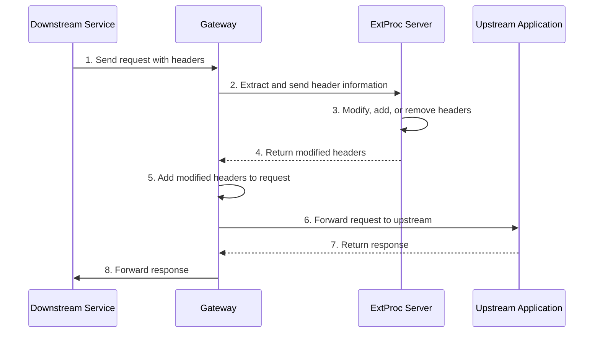

Modify aspects of an HTTP request or response with an external processing server. 

## About external processing

With the external processing, you can implement an external gRPC processing server that can read and modify all aspects of an HTTP request or response, and add that server to the agentgateway proxy processing chain. The external service can manipulate headers of a request before it is forwarded to an upstream or downstream service. The request or response can also be terminated at any given time.

With this approach, you have the flexibility to apply your requirements to all types of apps, without the need to run WebAssembly or other custom scripts.

### How it works

The following diagram shows how request header manipulation works when an external processing server is used.



### ExtProc server considerations

The ExtProc server is a gRPC interface that must be able to respond to events in the lifecycle of an HTTP request. When ExtProc is enabled and a request or response is received on the gateway proxy, the proxy communicates with the ExtProc server by using bidirectional gRPC streams.

To implement your own ExtProc server, make sure that you follow [Envoy's technical specification for an external processor](https://www.envoyproxy.io/docs/envoy/latest/api-v3/extensions/filters/http/ext_proc/v3/ext_proc.proto#extensions-filters-http-ext-proc-v3-externalprocessor). This guide uses a sample ExtProc server that you can use to try out the ExtProc functionality.



## Set up an ExtProc server

Use a sample ExtProc server implementation to try out the ExtProc functionality in .

1. Set up the ExtProc server. This example uses a prebuilt ExtProc server that manipulates request and response headers based on instructions that are sent in an instructions header.
   ```yaml {paths="extproc"}
   kubectl apply -n  -f- <<EOF
   apiVersion: apps/v1
   kind: Deployment
   metadata:
     name: ext-proc-grpc
   spec:
     selector:
       matchLabels:
         app.kubernetes.io/name: ext-proc-grpc
     replicas: 1
     template:
       metadata:
         labels:
           app.kubernetes.io/name: ext-proc-grpc
       spec:
         containers:
           - name: ext-proc-grpc
             # Source code for this image is in test/e2e/features/agentgateway/extproc/example
             image: gcr.io/solo-test-236622/ext-proc-example-basic-sink:0.0.7
             imagePullPolicy: IfNotPresent
             ports:
               - containerPort: 18080
   ---
   apiVersion: v1
   kind: Service
   metadata:
     name: ext-proc-grpc
     labels:
       app: ext-proc-grpc
   spec:
     ports:
     - port: 4444
       targetPort: 18080
       protocol: TCP
       appProtocol: kubernetes.io/h2c
     selector:
       app.kubernetes.io/name: ext-proc-grpc
   EOF
   ```
   
   The `instructions` header must be provided as a JSON string in the following format:
   ```json
   {
     "addHeaders": {
       "header1": "value1",
       "header2": "value2"
     },
     {
     "removeHeaders": [ "header3", "header4" ],
     }
   }
   ```


YAMLTest -f - <<'EOF'
- name: wait for ext-proc-grpc deployment to be ready
  wait:
    target:
      kind: Deployment
      metadata:
        namespace: agentgateway-system
        name: ext-proc-grpc
    jsonPath: "$.status.availableReplicas"
    jsonPathExpectation:
      comparator: greaterThan
      value: 0
    polling:
      timeoutSeconds: 300
      intervalSeconds: 5
EOF


2. Verify that the ExtProc server is up and running.
   ```sh
   kubectl get pods -n  | grep ext-proc-grpc
   ```
<!--
3. Continue with configuring ExtProc for a [route](#route) or [gateway](#gateway).
-->

## Set up ExtProc

You can enable ExtProc for a particular route in an HTTPRoute resource. 
   
1. Create an  that enables external processing for the agentgateway-proxy.
   ```yaml {paths="extproc"}
   kubectl apply -f- <<EOF
   apiVersion: 
   kind: 
   metadata:
     name: extproc
     namespace: 
   spec:
     targetRefs:
     - group: gateway.networking.k8s.io
       kind: Gateway
       name: agentgateway-proxy
     traffic: 
       extProc:
         backendRef: 
           name: ext-proc-grpc
           namespace: 
           port: 4444
   EOF
   ```
   

YAMLTest -f - <<'EOF'
- name: extproc - /headers returns 200 with extproc header injected
  retries: 10
  http:
    url: "http://${INGRESS_GW_ADDRESS}:80/headers"
    method: GET
    headers:
      host: www.example.com
      instructions: '{"addHeaders":{"extproc":"true"}}'
  source:
    type: local
  expect:
    statusCode: 200
    bodyJsonPath:
      - path: "$.headers.Extproc[0]"
        comparator: equals
        value: "true"
EOF


2. Send a request to the httpbin app along the `/headers` path and provide your instructions in the `instruction` header. This example instructs the ExtProc server to add the `extproc: true` header. Verify that you get back a 200 HTTP response and that your response includes the `extproc: true` header.

   

   {}
   ```sh
   curl -vi http://$INGRESS_GW_ADDRESS:8080/headers -H "host: www.example.com" -H 'instructions: {"addHeaders":{"extproc":"true"}}' 
   ```
   {}

   {}
   ```sh
   curl -vi http://localhost:8080/headers -H "host: www.example.com" -H 'instructions: {"addHeaders":{"extproc":"true"}}' 
   ```
   {}

   

   Example output:

   ```console {hl_lines=[10,11]}
   < HTTP/1.1 200 OK
   HTTP/1.1 200 OK
   ...
   < 
   {
     "headers": {
       "Accept": [
         "*/*"
       ],
       "Extproc": [
         "true"
       ],
       "Host": [
         "www.example.com"
       ],
       "Instructions": [
         "{\"addHeaders\":{\"extproc\":\"true\"}}"
       ],
       "User-Agent": [
         "curl/8.7.1"
       ]
     }
   }
   ...
   ```

## Configure processing options

By default, ExtProc sends request headers, response headers, request trailers, and response trailers to the external processor, and streams request and response bodies. To change which request or response phases are sent to the external processor, configure `traffic.extProc.processingOptions`.


The default body mode is `FullDuplexStreamed`. If the external processor must inspect a complete body before the gateway forwards it, use `Buffered` or `BufferedPartial` and account for the 8KB buffer limit.


| Field | Default | Values | Description |
| --- | --- | --- | --- |
| `traffic.extProc.processingOptions.requestHeaderMode` | `Send` | `Send`, `Skip` | Send or skip request headers. |
| `traffic.extProc.processingOptions.responseHeaderMode` | `Send` | `Send`, `Skip` | Send or skip response headers. |
| `traffic.extProc.processingOptions.requestBodyMode` | `FullDuplexStreamed` | `None`, `Buffered`, `BufferedPartial`, `FullDuplexStreamed` | Control how request bodies are sent. `None` skips the body. `Buffered` buffers the full body and returns an error if the body is larger than 8KB. `BufferedPartial` buffers up to 8KB and sends that prefix if the body is larger. `FullDuplexStreamed` streams the body to the external processor. |
| `traffic.extProc.processingOptions.responseBodyMode` | `FullDuplexStreamed` | `None`, `Buffered`, `BufferedPartial`, `FullDuplexStreamed` | Control how response bodies are sent. The body modes behave the same as `requestBodyMode`, but apply to upstream responses. |
| `traffic.extProc.processingOptions.requestTrailerMode` | `Send` | `Send`, `Skip` | Send or skip request trailers. |
| `traffic.extProc.processingOptions.responseTrailerMode` | `Send` | `Send`, `Skip` | Send or skip response trailers. |
| `traffic.extProc.processingOptions.allowModeOverride` | `false` | `true`, `false` | Allow `mode_override` values returned by the external processor in matching header responses to update later request and response processing phases for the same exchange. |

The following example sends headers and trailers, buffers request bodies up to the 8KB limit, skips response bodies, and allows the external processor to override later processing phases after a matching header response.

```yaml
apiVersion: 
kind: 
metadata:
  name: extproc-processing-options
  namespace: 
spec:
  targetRefs:
  - group: gateway.networking.k8s.io
    kind: Gateway
    name: agentgateway-proxy
  traffic:
    extProc:
      backendRef:
        name: ext-proc-grpc
        namespace: 
        port: 4444
      processingOptions:
        requestHeaderMode: Send
        responseHeaderMode: Send
        requestBodyMode: BufferedPartial
        responseBodyMode: None
        requestTrailerMode: Send
        responseTrailerMode: Send
        allowModeOverride: true
```

You can also set `processingOptions` inside a conditional ExtProc policy. Each conditional policy can use different phase settings.

```yaml
apiVersion: 
kind: 
metadata:
  name: extproc-conditional-processing
  namespace: 
spec:
  targetRefs:
  - group: gateway.networking.k8s.io
    kind: Gateway
    name: agentgateway-proxy
  traffic:
    extProc:
      conditional:
      - condition: 'request.path.startsWith("/upload")'
        policy:
          backendRef:
            name: ext-proc-grpc
            namespace: 
            port: 4444
          processingOptions:
            requestBodyMode: Buffered
            responseBodyMode: None
      - policy:
          backendRef:
            name: ext-proc-grpc
            namespace: 
            port: 4444
          processingOptions:
            requestBodyMode: None
            responseBodyMode: None
```

## Conditional execution

To send only certain requests through external processing, use the `conditional` field on your `extProc` policy. For example, you can route LLM chat traffic through a content filter and bypass the processor for every other request. For details, see [Conditional policies]().

## Cleanup



```sh
kubectl delete  extproc -n 
kubectl delete deployment ext-proc-grpc -n 
kubectl delete service ext-proc-grpc -n 
```
