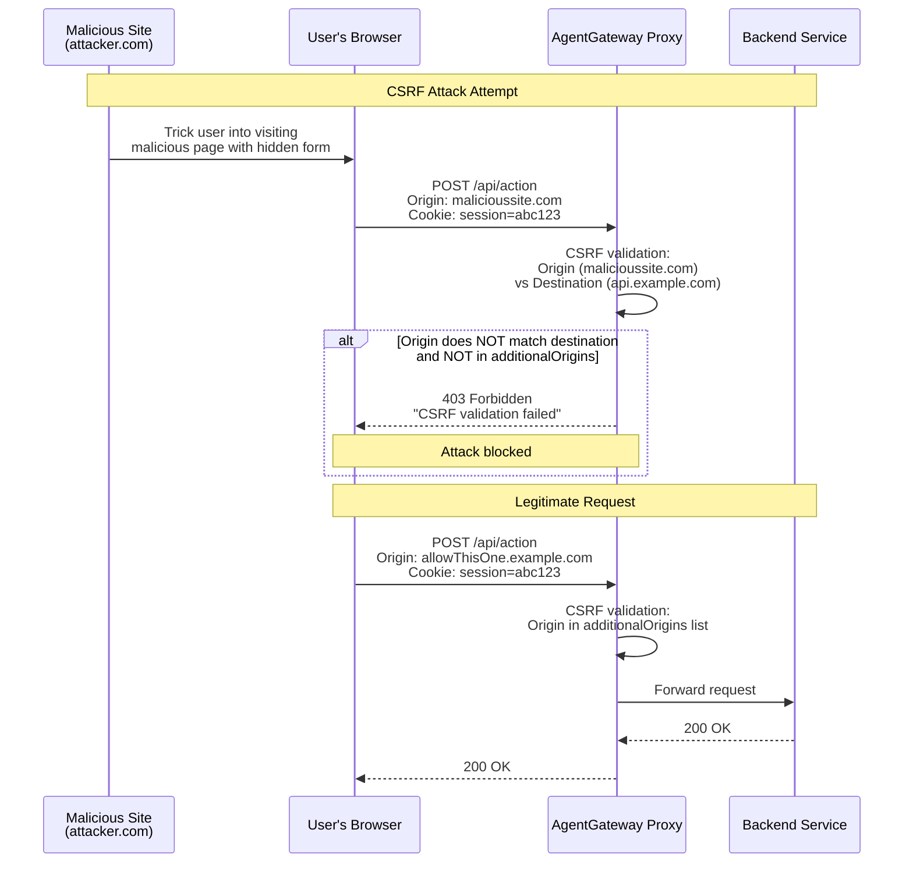

Attaches to: 







## About CSRF protection

According to [OWASP](https://owasp.org/www-community/attacks/csrf), CSRF is defined as follows:

> Cross-Site Request Forgery (CSRF) is an attack that forces an end user to execute unwanted actions on a web application in which they're currently authenticated. With a little help of social engineering (such as sending a link via email or chat), an attacker may trick the users of a web application into executing actions of the attacker's choosing. If the victim is a normal user, a successful CSRF attack can force the user to perform state changing requests like transferring funds, changing their email address, and so forth. If the victim is an administrative account, CSRF can compromise the entire web application.

To help prevent CSRF attacks, the CSRF policy implements a multi-layered validation approach to allow or block requests based on their properties. The policy checks that the request's origin matches its destination. If the origin and destination do not match, a 403 Forbidden error code is returned. Unlike CORS, CSRF protection works with all HTTP clients, not just browsers.

Review the following diagram to see an example CSRF request flow:


### Allowed requests

Allowed requests are as follows.

- Safe methods (`GET`, `HEAD`, `OPTIONS`) from any origin
- Same-origin requests (`Origin` matches `Host`)
- Requests from origins in `additionalOrigins`
- Requests with `Sec-Fetch-Site: same-origin` or `Sec-Fetch-Site: none`

### Blocked requests

Blocked requests, which receive a `403 Forbidden` response with the message "CSRF validation failed", are as follows.

- Cross-site requests with `Sec-Fetch-Site: cross-site` (unless trusted)
- Cross-site requests where `Origin` doesn't match `Host` (unless trusted)
- Malformed `Origin` headers in cross-site contexts

> [!NOTE]
> Note that because CSRF attacks specifically target state-changing requests, the filter only acts on HTTP requests that have a state-changing method such as `POST` or `PUT`.

## Configuration





```yaml
# yaml-language-server: $schema=https://agentgateway.dev/schema/config
mcp:
  port: 3000
  policies:
    csrf:
      additionalOrigins:
      - "https://www.example.com"
      - "https://trusted.domain.com"
  targets:
  - name: everything
    stdio:
      cmd: npx
      args: ["@modelcontextprotocol/server-everything"]
```


```yaml
# yaml-language-server: $schema=https://agentgateway.dev/schema/config
binds:
- port: 3000
  listeners:
  - routes:
    - policies:
        csrf:
          additionalOrigins:
          - "https://www.example.com"
          - "https://trusted.domain.com"
      backends:
      - host: localhost:8080
```




# WHAT THIS TEST VALIDATES:
#   * The csrf policy with an additionalOrigins list is accepted by agentgateway
#     in both the routing-based (binds) and simplified MCP (mcp.policies) forms.
# WHAT THIS TEST DOES NOT VALIDATE (and why):
#   * That cross-site requests are actually blocked/allowed at runtime — requires
#     a backend the page omits to forward to.
#   * The standalone `additionalOrigins: []` snippet later on the page is a
#     fragment (no binds:), so it is intentionally not tested.
cat <<'EOF' > config.yaml
# yaml-language-server: $schema=https://agentgateway.dev/schema/config
binds:
- port: 3000
  listeners:
  - routes:
    - policies:
        csrf:
          additionalOrigins:
          - "https://www.example.com"
          - "https://trusted.domain.com"
      backends:
      - host: localhost:8080
EOF
agentgateway -f config.yaml --validate-only

cat <<'EOF' > config-mcp.yaml
# yaml-language-server: $schema=https://agentgateway.dev/schema/config
mcp:
  port: 3000
  policies:
    csrf:
      additionalOrigins:
      - "https://www.example.com"
      - "https://trusted.domain.com"
  targets:
  - name: everything
    stdio:
      cmd: npx
      args: ["@modelcontextprotocol/server-everything"]
EOF
agentgateway -f config-mcp.yaml --validate-only


The `additionalOrigins` setting is a list of trusted origins allowed to make cross-site requests.
- Format: `"scheme://host[:port]"`
- Examples: `"https://www.example.com"`, `"http://localhost:3000"`

For strict CSRF protection to prevent all cross-site requests, set `additionalOrigins` to an empty list, as shown in the following route-level policy.

```yaml
policies:
  csrf:
    additionalOrigins: []
```
