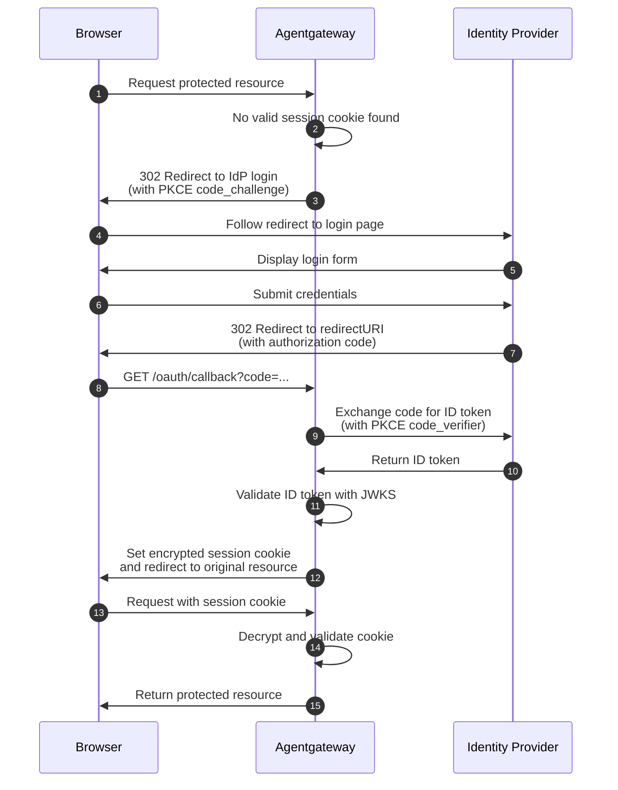

Attaches to: 



OIDC browser authentication provides built-in OpenID Connect login for browser-based clients. Unauthenticated requests are automatically redirected to the identity provider's login page. After successful authentication, the user's session is maintained with encrypted cookies.

The OIDC policy uses the OAuth 2.0 Authorization Code Flow with PKCE (Proof Key for Code Exchange) for secure browser-based authentication without requiring a separate proxy like oauth2-proxy.

## About

The following diagram shows the OIDC browser authentication flow between the browser, agentgateway, and identity provider.



* **Steps 1-3: Unauthenticated request**. When a browser request arrives without a valid session cookie, the gateway redirects the user to the identity provider's login page.
* **Steps 4-6: Login**. The user authenticates with the identity provider.
* **Steps 7-8: Callback**. After login, the identity provider redirects back to the `redirectURI` with an authorization code.
* **Steps 9-11: Token exchange**. The gateway exchanges the authorization code for an ID token using PKCE.
* **Steps 12-15: Session cookie**. The gateway sets an encrypted session cookie containing the ID token claims. Subsequent requests use this cookie.

### Session management

Review the following details about session management.

- Session cookies are encrypted and tamper-proof.
- The gateway always requests the `openid` scope to obtain an ID token.
- The gateway uses PKCE automatically to protect against authorization code interception.

## Configuration

Add the `oidc` policy to a route to protect it with browser-based OIDC authentication.



```yaml
# yaml-language-server: $schema=https://agentgateway.dev/schema/config
llm:
  policies:
    oidc:
      issuer: http://localhost:7080/realms/agentgateway
      clientId: agentgateway-browser
      clientSecret: agentgateway-secret
      redirectURI: http://localhost:3000/oauth/callback
      scopes:
      - profile
      - email
  models:
  - name: "*"
    provider: openAI
    params:
      apiKey: "$OPENAI_API_KEY"
```


```yaml
# yaml-language-server: $schema=https://agentgateway.dev/schema/config
mcp:
  port: 3000
  policies:
    oidc:
      issuer: http://localhost:7080/realms/agentgateway
      clientId: agentgateway-browser
      clientSecret: agentgateway-secret
      redirectURI: http://localhost:3000/oauth/callback
      scopes:
      - profile
      - email
  targets:
  - name: everything
    stdio:
      cmd: npx
      args: ["@modelcontextprotocol/server-everything"]
```


```yaml
# yaml-language-server: $schema=https://agentgateway.dev/schema/config
binds:
- port: 3000
  listeners:
  - routes:
    - backends:
      - host: localhost:18080
      matches:
      - path:
          pathPrefix: /
      policies:
        oidc:
          issuer: http://localhost:7080/realms/agentgateway
          clientId: agentgateway-browser
          clientSecret: agentgateway-secret
          redirectURI: http://localhost:3000/oauth/callback
          scopes:
          - profile
          - email
```



### Keycloak example

Review the following example for a Keycloak IdP.



```yaml
# yaml-language-server: $schema=https://agentgateway.dev/schema/config
llm:
  policies:
    oidc:
      issuer: http://keycloak.example.com/realms/myrealm
      clientId: agentgateway-browser
      clientSecret: my-client-secret
      redirectURI: http://localhost:3000/oauth/callback
      scopes:
      - profile
      - email
  models:
  - name: "*"
    provider: openAI
    params:
      apiKey: "$OPENAI_API_KEY"
```


```yaml
# yaml-language-server: $schema=https://agentgateway.dev/schema/config
mcp:
  port: 3000
  policies:
    oidc:
      issuer: http://keycloak.example.com/realms/myrealm
      clientId: agentgateway-browser
      clientSecret: my-client-secret
      redirectURI: http://localhost:3000/oauth/callback
      scopes:
      - profile
      - email
  targets:
  - name: everything
    stdio:
      cmd: npx
      args: ["@modelcontextprotocol/server-everything"]
```


```yaml
# yaml-language-server: $schema=https://agentgateway.dev/schema/config
binds:
- port: 3000
  listeners:
  - routes:
    - backends:
      - host: localhost:18080
      matches:
      - path:
          pathPrefix: /
      policies:
        oidc:
          issuer: http://keycloak.example.com/realms/myrealm
          clientId: agentgateway-browser
          clientSecret: my-client-secret
          redirectURI: http://localhost:3000/oauth/callback
          scopes:
          - profile
          - email
```



## Fields



| Field | Required | Description |
|-------|----------|-------------|
| `issuer` | Yes | OIDC provider issuer URL. Used for discovery and ID token validation. |
| `clientId` | Yes | OAuth2 client identifier registered with your identity provider. |
| `clientSecret` | Yes | OAuth2 client secret for token exchange. |
| `redirectURI` | Yes | Absolute callback URI handled by the gateway, such as `http://localhost:3000/oauth/callback`. |
| `scopes` | No | Additional OAuth2 scopes to request. `openid` is always included automatically. |
| `discovery` | No | Override the OIDC discovery document location. If omitted, uses `${issuer}/.well-known/openid-configuration`. |
| `authorizationEndpoint` | No | Explicit authorization endpoint. Overrides the value from discovery. |
| `tokenEndpoint` | No | Explicit token endpoint. Overrides the value from discovery. |
| `tokenEndpointAuth` | No | Client authentication method for the token endpoint. Discovery mode derives this from provider metadata. Explicit mode defaults to `clientSecretBasic`. |
| `jwks` | No | JWKS source for ID token validation. If omitted, uses the `jwks_uri` from discovery. |

## Access log enrichment

After setting up OIDC browser authentication, you can use JWT claims from the OIDC session in access logs. Add a frontend policy such as the following example.

```yaml
frontendPolicies:
  accessLog:
    add:
      user.id: jwt.sub
      user.email: jwt.email
```

## Learn more

- [Keycloak integration]()
- [Auth0 integration]()
- [MCP authentication]() for MCP-specific OAuth flows
